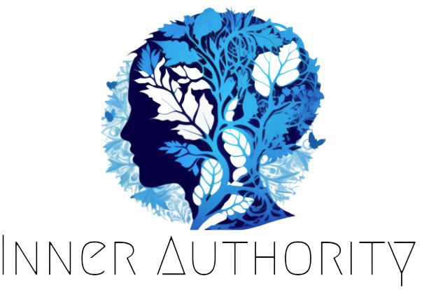

# [🚧 Work in Progress] Inner Authority

---

  

---

This repository contains the source code for the app called Inner Authority.

# Downloads

---
- [Android (Play Store)](https://play.google.com/store/apps/details?id=com.ade.ade&hl=en&gl=US)
- iOS (🚧WIP)

# Philosophy

---
At the heart of our app is a philosophy of mindfulness and conscious decision-making. In a world where we're often chasing quick hits of dopamine or fleeting moments of satisfaction, we wanted to offer a different kind of consumer product – one that prioritizes long-term progress and helps you cultivate greater awareness in your daily life.

Our philosophy is to develop apps designed to support you in making thoughtful choices that align with your values and aspirations, rather than simply catering to your immediate desires. By focusing on developing more mindful habits and behaviors over time, you can experience a deeper sense of fulfillment and purpose in your life.

# Features

---
## Supported Features

- Popup timer on selected apps
- Select upto 5 apps to show the popup on

## Planned Features

- More profiles for stricter or lenient sessions (More details on this soon!)
- Themes